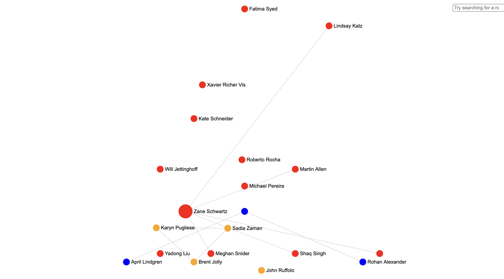

# What is Sigma.js? #
Sigma.js is a versatile, open-source JavaScript library dedicated to graph drawing. Using web technologies like WebGL, allows you to display interactive static and dynamic graphs, which aren’t just visually appealing but are also extremely powerful tools for data exploration and storytelling.

### graph visualization ###
Sigma.js is also called an graph visaulization tool.

## ScreenShot ##
